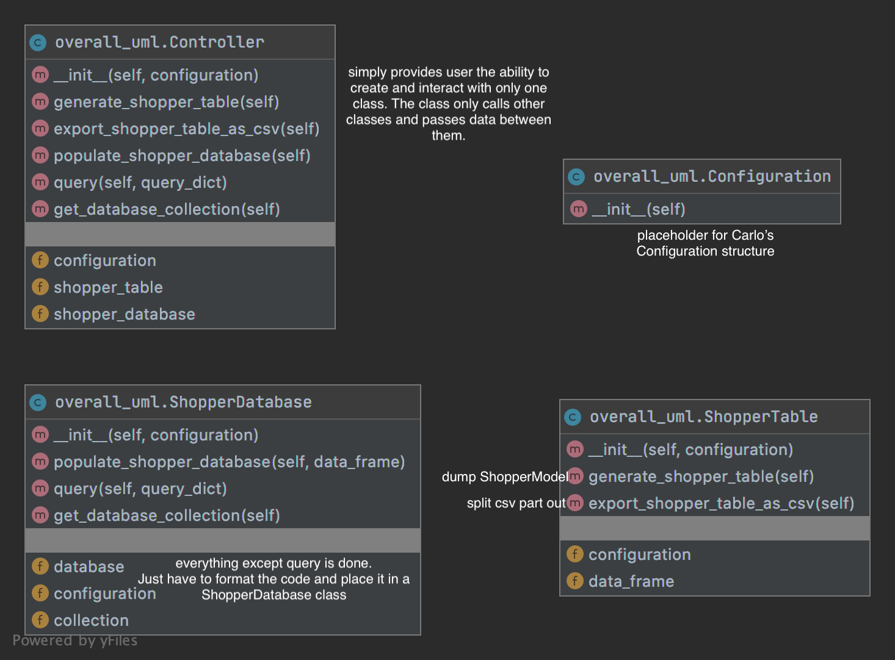

# History of UMLs for this project

## 6/15/2020
The purpose of this UML is to create wrappers to reduce dependencies between classes. This design makes it clear to each team member, what methods need to be available for other classes to work. It also gives everyone an idea how their class fit into the entire program.
The user interacts with this program through the command line. 
The command line program has default values for every parameter, but the user has the option to provide a different value for any parameters.

The input from the command line will be used to populate the Configuration class, which is a wrapper for the numerous subclasses of the configuration.

The Configuration class gets passed into a new instance of the Controller class.
This class has the option to create the shopper table and export as a csv, which are delegated to the ShopperTable class.
The Controller can also populate a database, or query the database, which are delegated to the ShopperDatabase class.

The ShopperTable class is a wrapper for everything inside ShopperModel package or the delivery product of Sprint 1.

The ShopperDatabase class is a new class created for Sprint 2. This class may get broken down further as Sprint 2 progresses.

The UML was created using overall_uml.py

